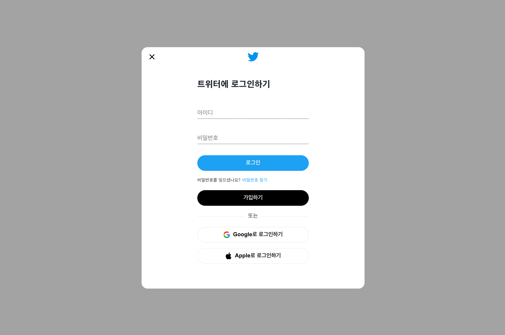
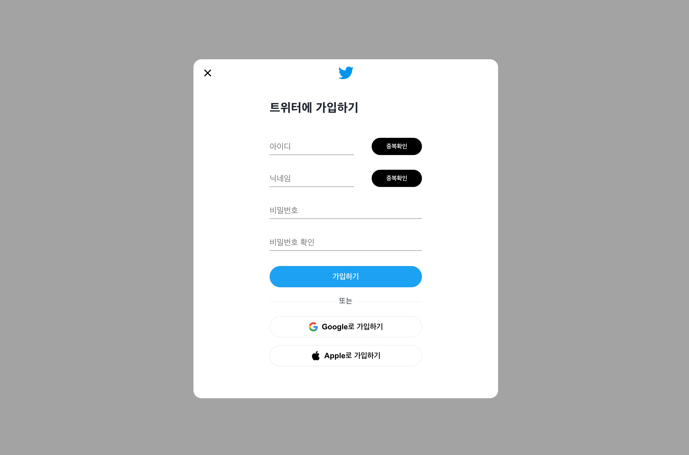
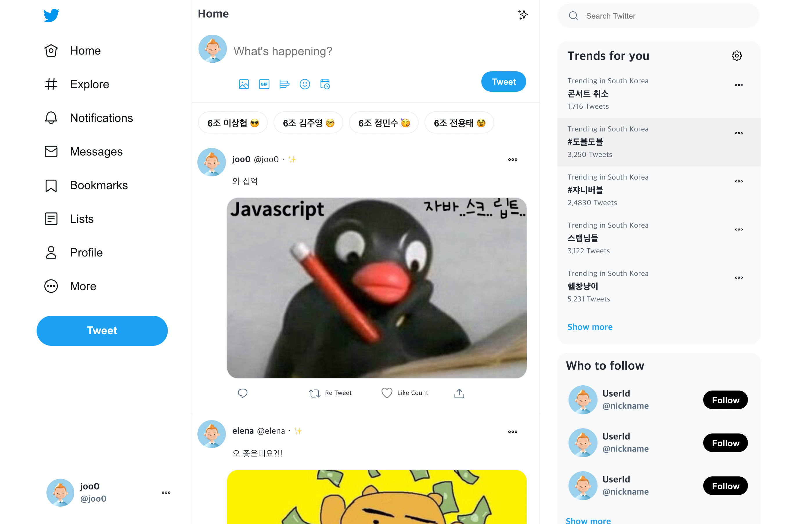
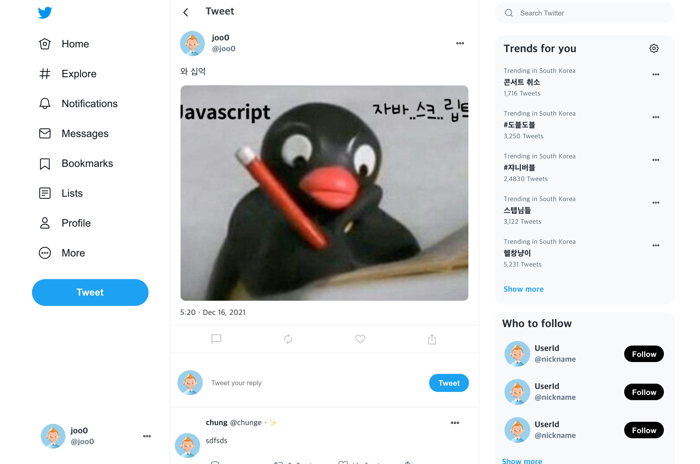

# 🔥 Twitter

> 항해99 트위터 클론코딩 주차 결과물 입니다.

    
  
- [\[시연영상 구경하기\]](https://youtu.be/epw5pc5Fpnw)

 

### 🖥️ Twitter Page View!

  
  
  
  
  

# 👥 멤버

- Back-end: [김주영](https://github.com/JooYoung2274), [이상협](https://github.com/23hh)
- Front-end: [전용태](https://github.com/yong313), [정민수](https://github.com/Chungune)
- [\[Front-End Github\]](https://github.com/CloneCoding-Twitter/Twitter-Front-End)
   

# 🗓 프로젝트 기간

- 2021년 12월 13일 ~ 2021년 12월 18일 (6일 간)

 

# ⚙️ 기술 스택

### Back-End

  
  
  
  

### Front-End

  
  
  
  
  
  
    
  

 

# 📌 API 명세서

[API 명세서 바로가기](https://www.notion.so/23h/Starting-Assignment-6-077c6d26c2824e2c8fbdfa20ac371a7e)

 

# 🔑 페이지 설명

- 로그인 페이지  
  \- 가입된 회원의 정보와 일치하는지 확인 후, 일치할 경우 로그인 성공
- 회원가입 페이지  
  \- 아이디 : 중복확인 / 영어 소문자 필수, 영어 대문자, 숫자 선택 3글자 이상  
  \- 닉네임 : 중복확인 / 영어 소문자 필수, 영어 대문자, 숫자 선택 3글자 이상  
  \- 비밀번호 : 영어 소문자 필수, 영어 대문자, 숫자 선택 3글자 이상  
  \- 비밀번호 확인 : 위 비밀번호와 일치하는지 확인
- 메인 페이지  
  \- 전체 게시글 조회 기능
  \- 로그인 유저 정보 보여주기
  \- 글 + 이미지 작성
- 게시글 상세 페이지  
  \- 클릭한 게시글 조회 정보
  \- 게시글 삭제 기능
  \- 해당 게시글에 달린 전체 댓글 조회 기능
  \- 댓글 삭제 기능

 
